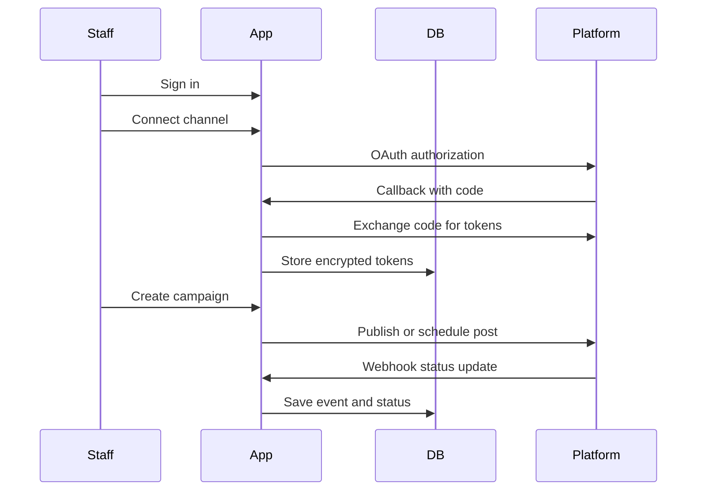

# Application Architecture

## Why This Architecture

For the first practical version, use one full-stack application instead of a separate AI platform. The application should solve the business workflow first: connect channels, create campaigns, approve content, publish, and track results.

AI can be added later as an assistant inside the same app, for example to draft captions, translate English/Arabic/Malayalam messages, or suggest product-category content.

## Components

| Component | Responsibility |
| --- | --- |
| Next.js dashboard | Staff UI for connections, campaigns, approval, and reports |
| Route handlers | OAuth callbacks, publishing endpoints, webhook receivers |
| Prisma/PostgreSQL | Users, organizations, connected accounts, campaigns, posts, audit logs |
| Token encryption | Protect platform access and refresh tokens |
| Webhooks | Receive delivery, comment, mention, and post-status events |
| Job worker later | Schedule posts, retry failed publishing, sync analytics |

## Request Flow

## Integration Order

1. Meta first: Facebook Pages, Instagram Business, WhatsApp Business.
2. X second: OAuth 2.0 and posting workflow.
3. TikTok third: business/content posting permissions.
4. AI drafting after approval workflow exists.

This order gives the fastest business value because Meta covers three requested channels under one developer platform.
